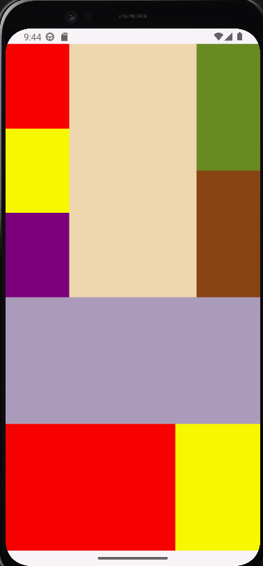
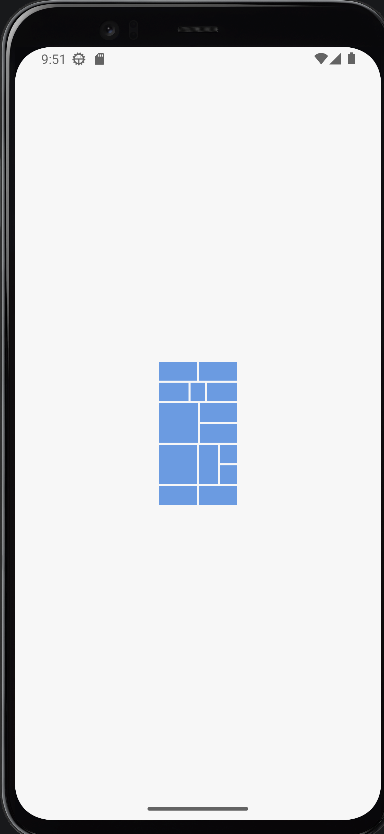

# Отчет

## Практическая работа №2

## Основы XML-разметки. Менеджеры размещения LinearLayout и GridLayout

**Выполнил:**  
Майстренко Константин Александрович  
**Группа:** инс-б-о-24-2  

---

### Цель работы

Изучить основы языка разметки XML для описания пользовательского интерфейса Android-приложений.  
Научиться использовать менеджеры размещения `LinearLayout` и `GridLayout` для создания интерфейсов.  
Освоить основные атрибуты `View` и создание простых `Drawable`-ресурсов.

### Ход работы

В ходе выполнения практической работы был создан Android-проект, в котором интерфейс приложения описывался с помощью XML-разметки.

Сначала были изучены основные принципы построения интерфейса в Android, а также основные атрибуты элементов (`layout_width`, `layout_height`, `padding`, `margin`, `gravity` и др.).

Далее были созданы Drawable-ресурсы (`rectangle.xml` и `circle.xml`), которые использовались для отображения фигур на экране.

После этого был реализован интерфейс с использованием контейнера `LinearLayout`, где элементы размещались вертикально и горизонтально с различными параметрами выравнивания.

Затем был изучен контейнер `GridLayout`, с помощью которого была создана сетка элементов и реализовано объединение ячеек.

В рамках самостоятельной части были выполнены задания:
- построение композиции с использованием вложенных `LinearLayout`;
- создание интерфейса по варианту с использованием менеджеров размещения.

  
*Рисунок 1. Композиция с использованием вложенных LinearLayout*

  
*Рисунок 2. Реализация композиции по варианту с использованием контейнеров*

### Вывод

В результате выполнения практической работы были изучены основы XML-разметки в Android.  
Я научился создавать пользовательские интерфейсы с помощью `LinearLayout` и `GridLayout`, управлять расположением элементов на экране, а также создавать простые графические ресурсы.  
Практическая работа позволила закрепить навыки работы с XML и лучше понять принципы построения интерфейсов в Android-приложениях.

### Ответы на контрольные вопросы

1. **Что такое XML? Для каких целей он используется в Android-разработке?**  
   XML — это язык разметки, используемый для описания структуры данных. В Android он применяется для создания интерфейсов, описания ресурсов (строк, цветов, стилей и т.д.) и разделения логики приложения и его визуальной части.

2. **Что такое тег (элемент) в XML? Из каких частей он состоит?**  
   Тег — это элемент XML, состоящий из имени и атрибутов. Он может быть одиночным или парным (с открывающим и закрывающим тегом).

3. **Какие менеджеры размещения (контейнеры) вы знаете?**  
   LinearLayout, GridLayout, ConstraintLayout, RelativeLayout, FrameLayout, TableLayout.

4. **В чём разница между LinearLayout и GridLayout?**  
   LinearLayout размещает элементы в одну линию (по вертикали или горизонтали), а GridLayout — в виде сетки (строки и столбцы).

5. **Что такое match_parent и wrap_content?**  
   match_parent — элемент занимает всё доступное пространство.  
   wrap_content — размер зависит от содержимого.

6. **В чём разница между android:gravity и android:layout_gravity?**  
   gravity — выравнивает содержимое внутри элемента.  
   layout_gravity — выравнивает сам элемент внутри родителя.

7. **Какие единицы измерения используются в Android?**  
   px, dp, sp. dp — для размеров элементов, sp — для текста.

8. **Как создать простую фигуру через drawable?**  
   Создать XML-файл в папке drawable с тегом `<shape>` и задать параметры формы, цвета и размеров.
